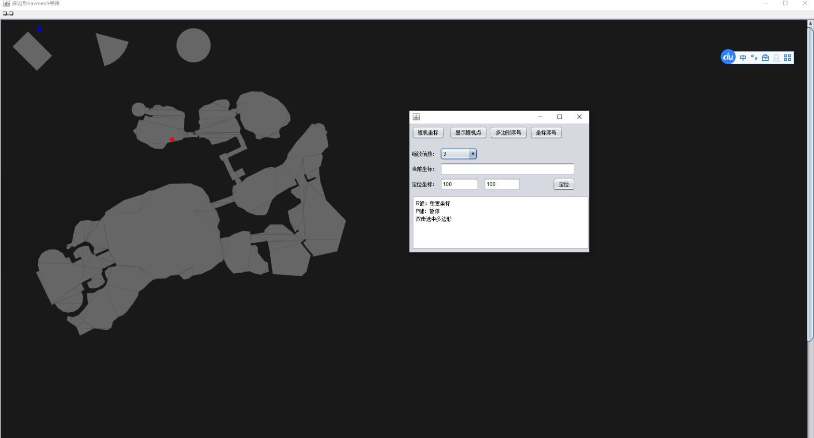

&emsp;&emsp;基于unity的navmesh寻路，用于将unity中的三角网格行走层数据导入服务器中，用于服务器进行怪物的AI、玩家寻路、技能战斗等判断。
寻路方式采用A*算法。服务器算法参考 [GameAi4j](https://github.com/jzyong/GameAi4j) 项目，客户端操作参考 [NavMeshDemo](https://github.com/jzyong/NavMeshDemo)

## 客户端导出navmesh数据操作
1. 创建地图场景1_NewbieArea，创建行走层对象model_1_xzm，Static选择Navigation Static
2. 选择 `工具/导出服务器NavMesh`弹出工具窗口
3. 点击测试地图大小，修改地图范围
4. 点击生成服务器数据
   
5. 进入`Config/NavMeshBuild` 目录运行run.cmd 查看服务器运行效果(需要安装jdk14运行环境)
6. 将生成的 *.navmesh 复制到服务器
   

## 寻路方式

### 多边形寻路
多边形寻路参考`PolygonNavMesh` 原理： 
1. 将unity导出的数据生成凸多边形
2. 找出所有凸多边形共享的边
3. 使用A*算法找出起点到目标点所经过的多边形列表
4. 使用漏斗算法找出顶点坐标

## 三角形寻路
三角形寻路参考`TriangleNavMesh` 原理同多边形

## 总结
1. 多边形寻路和三角形寻路由于原理相同，性能消耗差不多，由于多边形合并了三角形，速度稍微快一些；顶点寻路相比于多边形寻路慢了5~40倍
2. 多边形寻路需要导出的寻路数据在行走层中没有额外的顶点，共边顶点坐标需要一致，顶点寻路由于由于采用阻挡区三角形顶点寻路，因此没有此限制，但是增加了额外的阻挡区数据
3. 多边形寻路支持3D寻路，顶点寻路只能平面寻路
